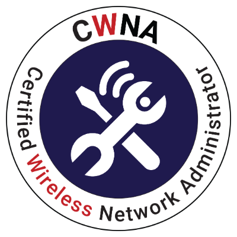
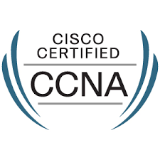

<h1 align="center">Hi 👋, I'm V Mounika</h1>
<h3 align="center">Network Engineer | Turning Complex Networks into Seamless Experiences | Cloud, Automation & Wireless Solutions Enthusiast</h3>

- 🔭 Graduated recently with a **Masters in Information and Communication Technology**, Concentration in **Telecommunications Technology** – **University of Denver**
  
- 🌱 I’m building and optimizing networks while learning **SDN/NFV, network automation, and AWS cloud networking**
  
- 💬 Ask me about **network design, routing & switching, LAN/WAN troubleshooting, Wi-Fi optimization, Python scripting for networks, or network security**
  
- 📫 How to reach me: [Mounika.vangali@du.edu](mailto:Mounika.vangali@du.edu)  

<h3 align="left">Certifications & Achievements:</h3>

  <!-- CCNA Intro -->
  

  <!-- AWS -->
  

  <!-- CWNA -->
  

  <!-- CCNA -->
  

